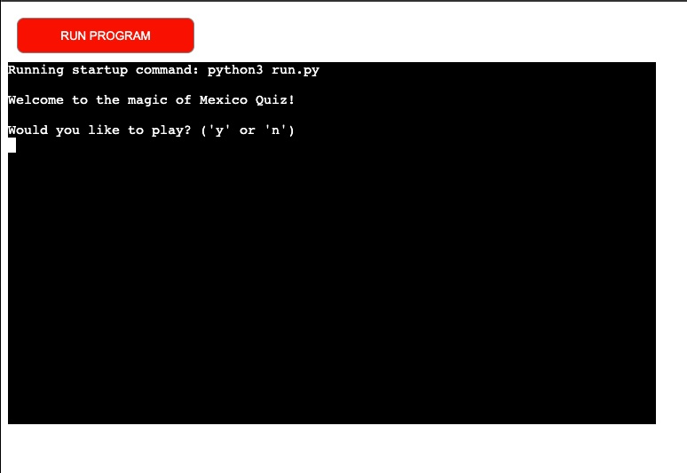
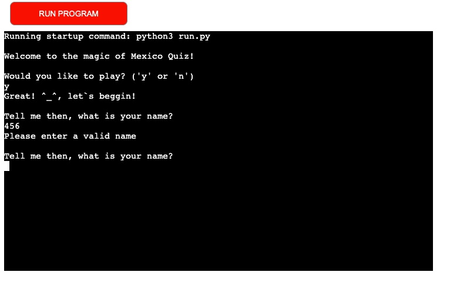
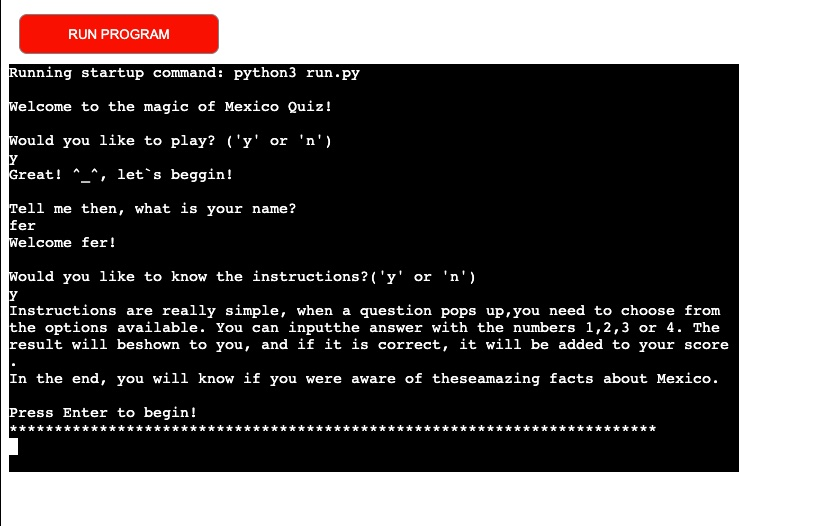
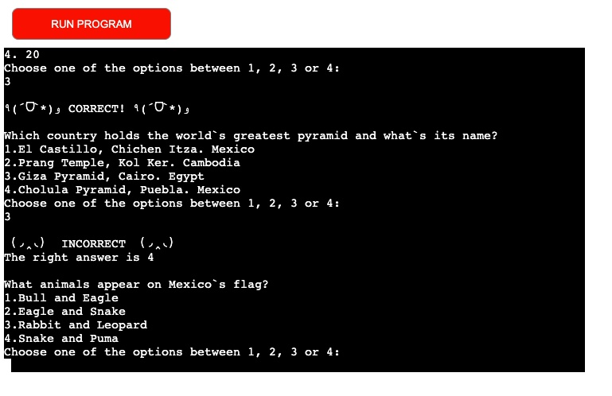
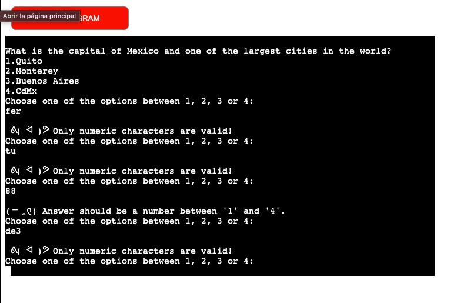
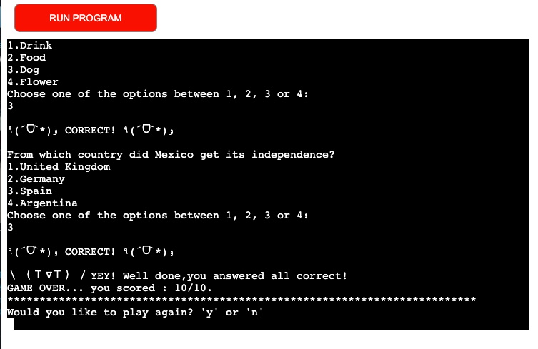
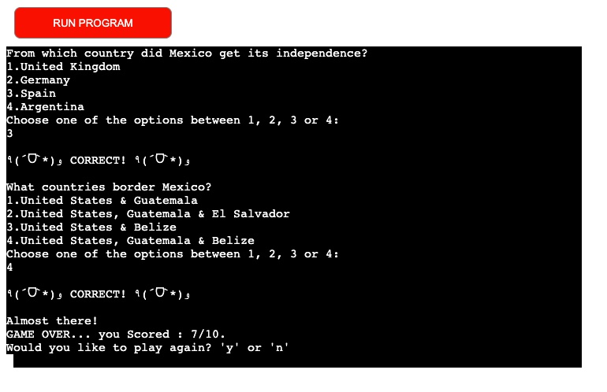
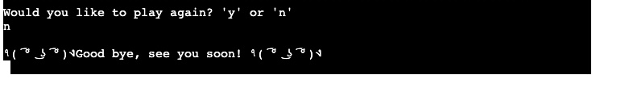

# **Mexico is Magic Quiz**
[_Click here to view live deployment_](https://magicmexico-92655f369bba.herokuapp.com/)

Mexico is Magic is a simple Python quiz game that deploys to a console.

This quiz game starts running with a welcome message, where the user is asked to provide input like their username, and whether they want to play or not.  This is followed by 10 questions, each, with 4 possible choices and just one answer to choose from. 

All the data is stored in the run.py file and nothing is imported or exported to any external file. 
it includes functions that help the program get data from the user, validate the input of the player so we have just the right values, calculate a score and restart the program if needed. 

## **Features**

### How to play

*The empty screen opens with a Welcome message.

*The player is asked whether they want to play, and if the answer is 'y' they are asked what is their name. If the answer is 'n' the program quits.

*The username can not be left empty and the program will ask again for their name and validate the data in alphabetical characters. 

*The player is then, asked whether they want to read the instructions or skip that step. when the answer is 'n' the program goes directly to the option "Press Enter to continue". If the player answers 'y' the instructions display and they need to press " enter" to continue. If they input data other than 'y' or 'n' they are asked to enter valid data.

*After this, the multiple choice questions display randomly,  selected by the program, and the user is prompted to select an answer from the list numbered 1-4. the goal is for the user to guess correctly as many as possible.

*After answering all 10 questions, the score of the player is displayed in an x/10 format.

*The player then has the option to restart the game or quit the program.

## Game elements 

### _1 - Welcome and Player username_

*After the welcome message, the player is asked weather if they want to play, and if so, they are asked to enter their username. 
*The player must enter a valid data type, that means any alphabetical character, and at least 1, otherwise they will receive an error message. 

### _2 - Instructions_

* After the player enters their name, they are offered the possibility of reading the instructions of the game or continuing without it. 

*After any of the two choices they are asked to press enter to continue to the quiz. 
*If they enter something other than 'y' or 'n', the player is asked to answer again the question.

### _3 - Quiz Questions_

* The player is presented with the first randomized quiz question.
this is achieved by the import random function at the beginning of the run.py file. 
image 'random.shuffle(data)'
* After the first question is printed in the console, the 4 possible choices appear, but only one is correct.  This is achieved by using the enumerate() function. this function itinerates through the items in the 'data' dictionary with all the 'questions', 'choices', and 'answer'.

* The console displays instructions on how to answer, and requests the player to input their answer via one of these numbers:  '1', '2', '3', or '4'.

* This loop is repeated until the 10th question is answered.

### _4 - Correct Answer_

 * When the player answered the question correctly, a message letting them know the answer was CORRECT will appear in the console.
!image correct 

 * When the answer is correct, the player's score will increase by one point. This variable is defined inside the same run_game() and the score will only be displayed at the end of the quiz. 

### _5 - Incorrect Answer_

*When the player answered the question correctly, a message letting them know the answer was INCORRECT will appear in the console. when this happens, the player's score will not be incremented.
!image incorrect 

### _6 - Invalid input verification_

 * If the player enters anything other than the digits 1-4 as an answer, the player will receive this message: " ᕕ( ᐛ )ᕗ Only answer numbers from '1' to '4', try again!"
the verification of the input is made by a while loop  that: 
1 converts any input into an integer.
2 checks whether the data is inside the range 1-4  

### _7 - Final Score_

 * When all 10 questions are answered, the console displays the score. The number of correct answers is compared to the number of total questions.

* When the player gets all 10 answers correctly, a unique message appears: " YEY! {player_username}, you are almost Mexican!"

### _8 - Play Again_

 * The console will display a message asking the player if they would like to play again. 

 * If the player enters 'y' the game will start again. If the player enters 'n' they will receive a closing message and the program will quit.

 * If the User presses 'y', the game will be restarted.
 * If the User presses 'n', they will receive a closing message, and the game ends.

# **Bugs**

* Through testing, I was made aware of many issues I had to fix and decisions I had to make when building my functions before I came up with the structure I made. 

[Link to the list of external resources used while creating this quiz game](workspaces/MexicoisMagic/ExternalResources.md)

[Quiz source information](https://www.funtrivia.com/)
[Quiz source information](https://www.quiztriviagames.com/mexico-quiz/)
[Python quiz game example](https://allinpython.com/create-a-simple-python-quiz-game-with-score/)
[Python quiz game example](https://realpython.com/python-quiz-application/)
[Python quiz game example](https://www.youtube.com/watch?v=QPp09g8Rspg)
[Python quiz game example](https://stackoverflow.com/questions/46406867/python-text-based-random-questions-quiz)
[Python quiz game example](https://www.codespeedy.com/check-if-user-input-is-a-string-or-number-in-python/)
[Validating username data](https://stackoverflow.com/questions/28495822/best-way-to-validate-a-name-in-python)
[Printing Multiple lines of text](https://stackoverflow.com/questions/34980251/how-to-print-multiple-lines-of-text-with-python)
[While loops](https://www.programiz.com/python-programming/while-loop#:~:text=Python%20While%20loop%20with%20else,the%20loop%20evaluates%20to%20False%20.&text=Note%3A%20The%20else%20block%20will,terminated%20by%20a%20break%20statement.
)
[String Fromatting](https://realpython.com/python-input-output/#:~:text=Writing%20Output%20to%20the%20Console,-In%20addition%20to&text=You%20can%20display%20program%20data,of%20arguments%20to%20print()%20.&text=As%20you%20can%20see%2C%20even,the%20console%20with%20print()%20)
[If, elif, else](https://www.datacamp.com/tutorial/elif-statements-python?utm_source=google&utm_medium=paid_search&utm_campaignid=19589720818&utm_adgroupid=143216588777&utm_device=c&utm_keyword=&utm_matchtype=&utm_network=g&utm_adpostion=&utm_creative=665485585125&utm_targetid=dsa-1947282172981&utm_loc_interest_ms=&utm_loc_physical_ms=9061135&utm_content=dsa~page~community-tuto&utm_campaign=230119_1-sea~dsa~tutorials_2-b2c_3-n-eu_4-prc_5-na_6-na_7-le_8-pdsh-go_9-na_10-na_11-na-ltsjul23&gclid=CjwKCAjw_aemBhBLEiwAT98FMpeiWPqUdONhSo6JN80aydGL2l7mcICESYoWI_GMVNMVYfntVRIILxoCyQMQAvD_BwE)
[Breaking from a loop](https://www.digitalocean.com/community/tutorials/how-to-use-break-continue-and-pass-statements-when-working-with-loops-in-python-3)
[Obtaining values from Dict](https://www.w3schools.com/python/python_dictionaries_access.asp)
[Enumerate Functions](https://intellipaat.com/blog/tutorial/python-tutorial/python-enumerate/?US)
[Enumerate Functions](https://www.freecodecamp.org/news/what-is-enumerate-in-python/)
[Enumerate Functions](https://pythonexamples.org/python-enumerate-a-dictionary/)
[Check multiple conditions](https://www.geeksforgeeks.org/check-multiple-conditions-in-if-statement-python/#:~:text=This%20can%20be%20done%20by,BOTH%20in%20a%20single%20statement.&text=and%20comparison%20%3D%20for%20this%20to,t%20check%20the%20second%20one.)
[Check multiple conditions](https://kodify.net/python/if-else/if-conditions/)
[Validating users input as an integer](https://www.101computing.net/number-only/)
[Nested functions](https://www.analyticsvidhya.com/blog/2021/08/how-nested-functions-are-used-in-python/)
[Try and Except](https://www.w3schools.com/python/python_try_except.asp)
[Python Dictionaries](https://www.codecademy.com/learn/dscp-python-fundamentals/modulesdscp-python-dictionaries/cheatsheet)
[List index method](https://www.learnbyexample.org/python-list-index-method)
[Fixing Pep8](https://w3.cs.jmu.edu/spragunr/CS240_F14/style_guide.shtml#:~:text=The%20preferred%20way%20of%20wrapping,a%20backslash%20for%20line%20continuation.)
[Fixing lenth of lines](https://www.pythonmorsels.com/breaking-long-lines-code-python/)
[Fixing lenth of lines](https://peps.python.org/pep-0008/#maximum-line-length)

